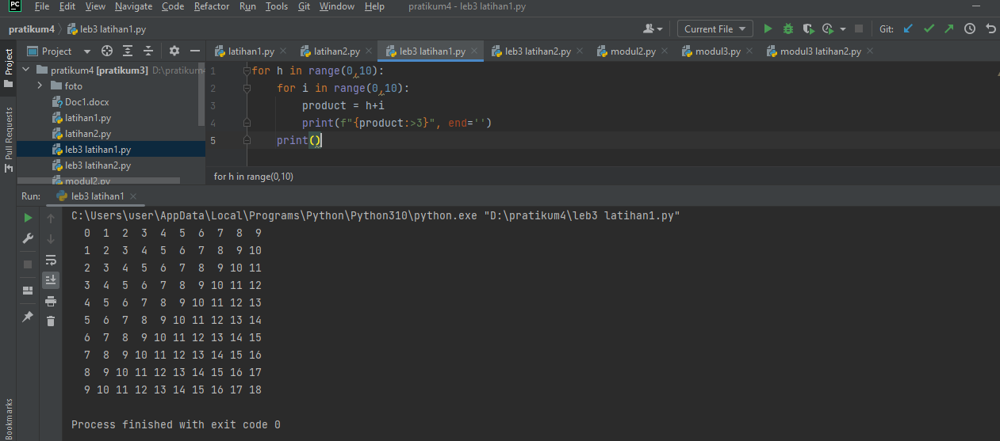
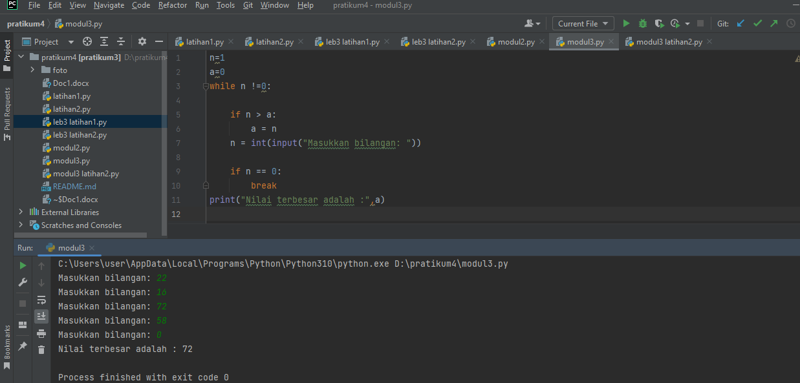

# PRATIKUM4
# Inayatus sholekhawati
# 312210200
# TI.22.A.2

### LAB 2:STRUKTUR KONDISI

## LATIHAN 1
### Membuat Progam Dengan Mengimput 2 Bilangan Untuk Menentukan Bilangan Terbesar Menggunakan STATEMENT IF
## Source Code Dan Output (Hasil Running Program)

Berikut sourece code latiahan 1:
```
a = int(input('Masukkan nilai a: '))
b = int(input('Masukkan nilai b: '))

if a > b:
    print(a, 'yang terbesar')
else:
    print(b, 'yang terbesar')
    
```


### LATIHAN 2
### Membuat program data berdasarkan input jumlah data dan urutkan hasil mulai dari data terkecil
## Source Code Dan Output (Hasil Running Program)
Berikut sourece code latiahan 2:
```
inisialisasi variabel luas dengan nilai berformat array
luas = [30,40,25,80,16,100]

urutkan data di dalam lisit dari yang terkacil ke yang terbesar
luas.sort()

tampilkan nilai dari variabelluas setelah pengurutan
print(luas)
[16,25,30,40,80,100]

```


### LAB 3: PERULANGAN

## LATIHAN 1
### Buat program dengan perulangan bertingkat (nested) for
Berikut output yang harus dihasilkan 
```
  0  1  2  3  4  5  6  7  8  9
  1  2  3  4  5  6  7  8  9 10
  2  3  4  5  6  7  8  9 10 11
  3  4  5  6  7  8  9 10 11 12
  4  5  6  7  8  9 10 11 12 13
  5  6  7  8  9 10 11 12 13 14
  6  7  8  9 10 11 12 13 14 15
  7  8  9 10 11 12 13 14 15 16
  8  9 10 11 12 13 14 15 16 17
  9 10 11 12 13 14 15 16 17 18
```
## Source Code Dan Output (Hasil Running Program)
Berikut sourece code latiahan 1:
```
for h in range(0,10):
    for i in range(0,10):
        product = h+i
        print(f"{product:>3}", end='')
    print()
```


## LATIHAN 2
### Membuat bilangan acak yang lebih kecil dari 0,5 Mengunkan kombinasi WHILE dan FOR
## Source Code Dan Output (Hasil Running Program)
Berikut sourece code latiahan 1:
```
import random
n = int(input("Masukkan nilai N :"))
for i in range(n):
    d = random.uniform(0.0, 0.5)
    print("Data ke :", i+1, "=> ",d)
print('tamat')
```


### MODUL PRAKTIKUM 2 STRUKTUR KONDISI
### Membuat program dengan mengimput 3 bilangan untuk menentukan bilangan yang paling besar mengunakan STETMANT IF
## Source Code Dan Output (Hasil Running Program)
Berikut sourece code modul praktikum 2 :
```
print("Paratikum2")

A = int (input("Masukan bilangan pertaman: "))
B = int (input("Masukan bilangan kedua: "))
C = int (input("Masukan bilangan ketiga: "))

if A > B > C :
    print("\nBilangan pertama adalah bilangan terbesar = %s" % A)
elif B > C :
    print("\nBilangan kedua adalah bilangan terbesar = %s" % B)
else :
    print("\nBilangan ketiga adalah bilangan terbesar = %s" %C)
```


## FLOWCHART
MULAI

INISIASI BIL1, BIL2, BIL3 SEBAGAI INTEGER.

BACA BIL1.

BACA BIL2.

BACA BILL3.

JIKA BIL1 > BIL2 DAN BIL1 > BIL3 MAKA KERJAKAN LANGKAH 8, SELAIN ITU

JIKA BIL2 > BIL1 DAN BIL2 > BIL3 MAKA KERJAKAN LANGKAH 9, SELAIN ITU KERJAKAN LANGKAH 10. 

CETAK "BILANGAN TERBESAR BILANGAN PERTAMA".

CETAK "BILANGAN TERBESAR BILANGAN KEDUA".

CETAK "BILANGAN TERBESAR BILANGAN KETIGA".

SELESAI.


### MODUL PRATIKUM 3 PERULANGAN
## Modul 3 latihan 1
### Membuat program menampilkan bilangan terbesar dari N sebauh data yang diinputkan dan masukkan angka 0 untuk brehenti
## Source Code Dan Output (Hasil Running Program)
Berikut sourece code modul 3 latihan 1 :
```
n=1
a=0
while n !=0:

    if n > a:
        a = n
    n = int(input("Masukkan bilangan: "))

    if n == 0:
        break
print("Nilai terbesar adalah :",a)
```


## Modul 3 latihan 2
### Membuat program sederhana dengan perulangan
## Source Code Dan Output (Hasil Running Program)
Berikut sourece code modul 3 latihan 2 :
```
n = 100000000
sum = 0
z = 0
laba = [int(0), int(0), int(n) * 0.01, int(n) * 0.01, int(n) * 0.05, int(n) * 0.05, int(n) * 0.02]
for i in laba:
    sum = sum+i
    z +=1
    print('total laba adalah : ', sum)
```

